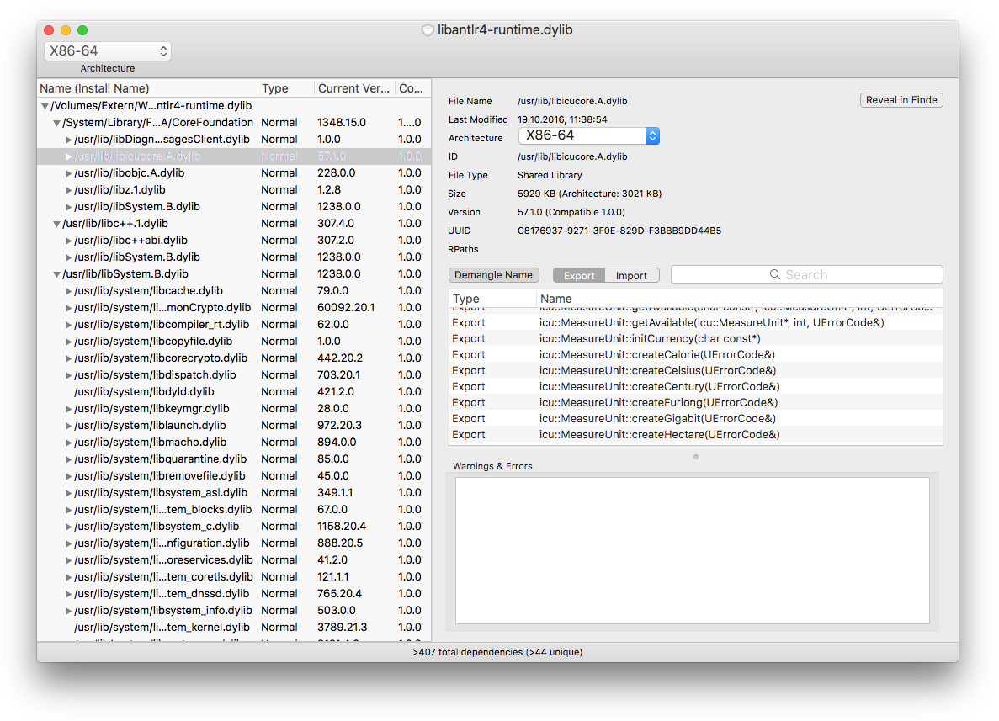

MacDependency shows all dependent libraries and frameworks of a given executable, dynamic library or framework on Mac OS X. It is a GUI replacement for the otool command, and provides almost the same functionality as the Dependency Walker (http://www.dependencywalker.com) on Windows.

More information available in the [Wiki](../../wiki).

